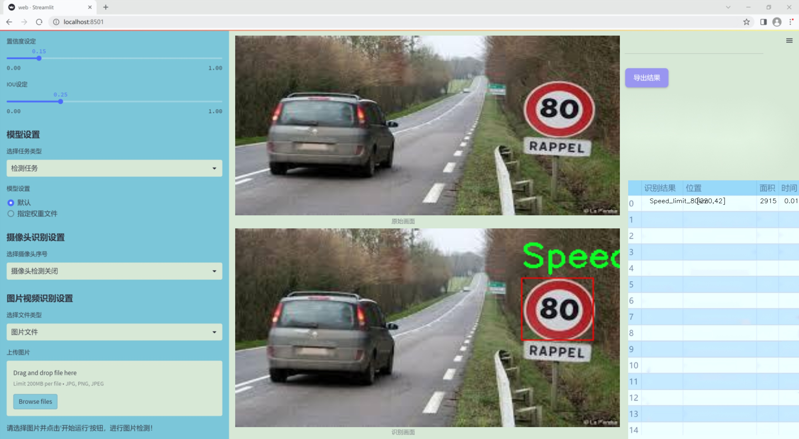
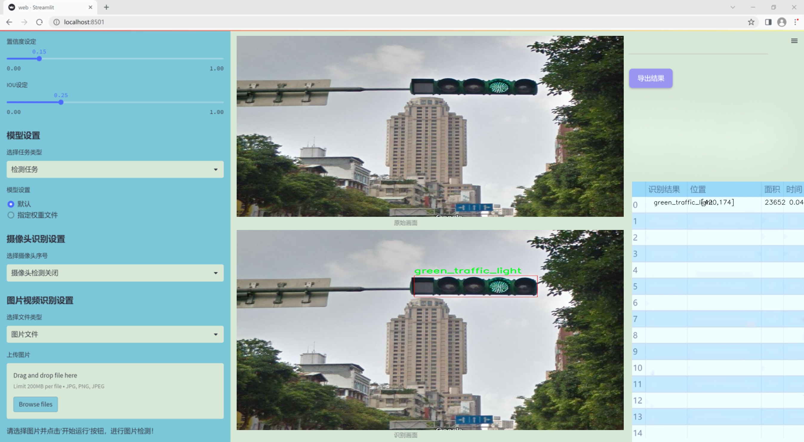
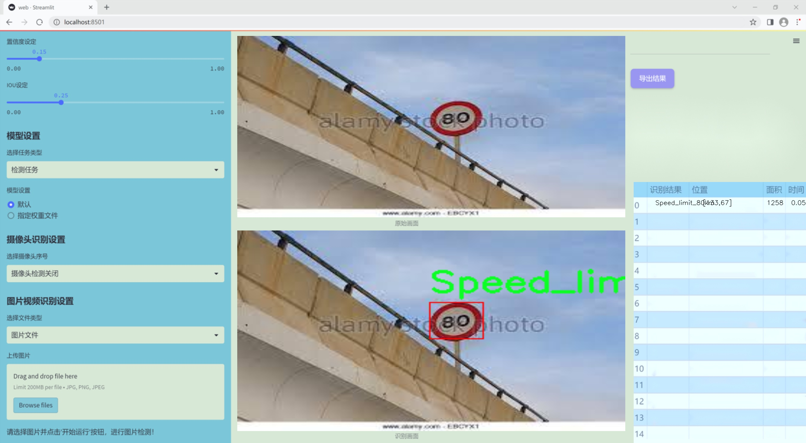
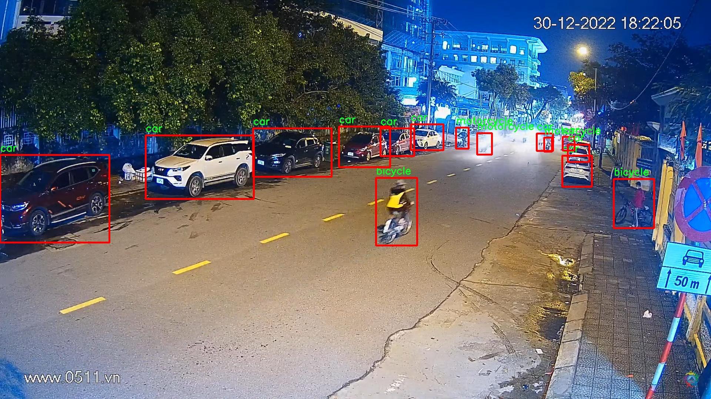
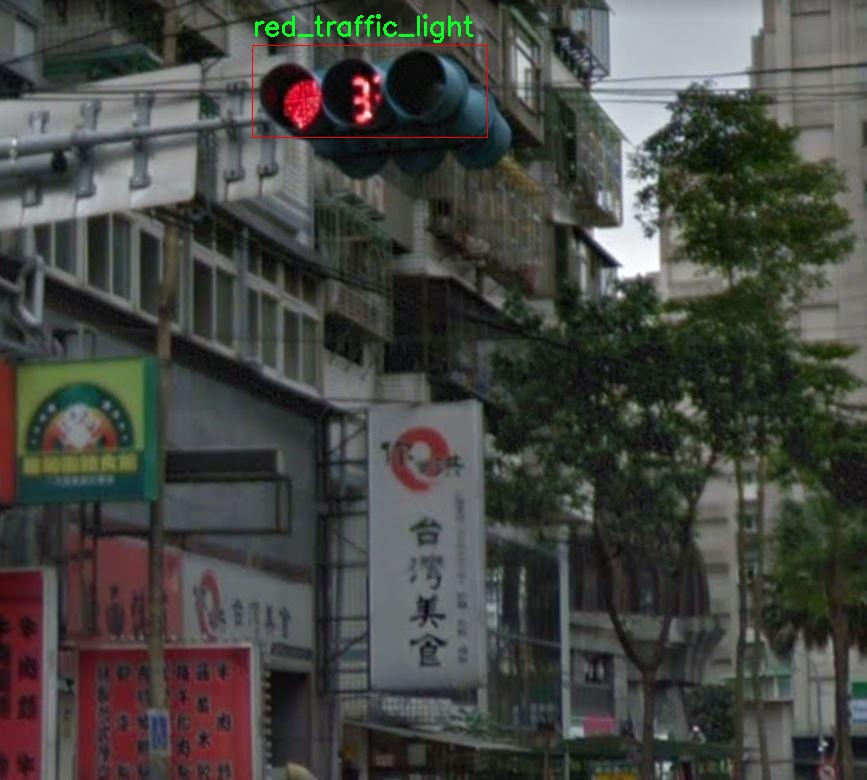
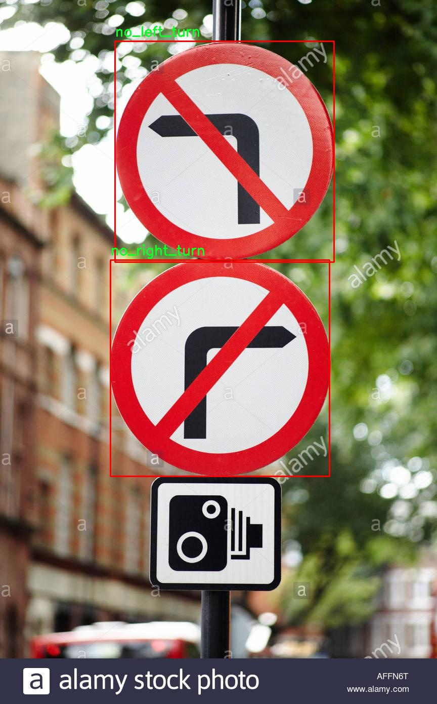
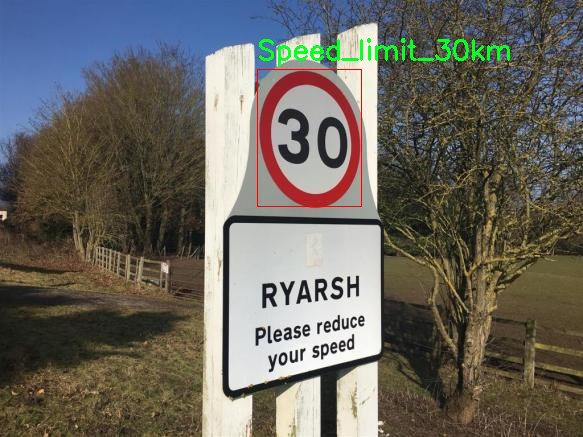
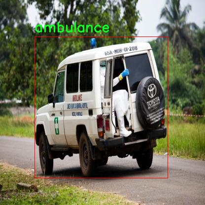

# 改进yolo11-CA-HSFPN等200+全套创新点大全：交通场景交通工具和交通标志检测系统源码＆数据集全套

### 1.图片效果展示







##### 项目来源 **[人工智能促进会 2024.11.03](https://kdocs.cn/l/cszuIiCKVNis)**

注意：由于项目一直在更新迭代，上面“1.图片效果展示”和“2.视频效果展示”展示的系统图片或者视频可能为老版本，新版本在老版本的基础上升级如下：（实际效果以升级的新版本为准）

  （1）适配了YOLOV11的“目标检测”模型和“实例分割”模型，通过加载相应的权重（.pt）文件即可自适应加载模型。

  （2）支持“图片识别”、“视频识别”、“摄像头实时识别”三种识别模式。

  （3）支持“图片识别”、“视频识别”、“摄像头实时识别”三种识别结果保存导出，解决手动导出（容易卡顿出现爆内存）存在的问题，识别完自动保存结果并导出到tempDir中。

  （4）支持Web前端系统中的标题、背景图等自定义修改。

  另外本项目提供训练的数据集和训练教程,暂不提供权重文件（best.pt）,需要您按照教程进行训练后实现图片演示和Web前端界面演示的效果。

### 2.视频效果展示

[2.1 视频效果展示](https://www.bilibili.com/video/BV1qWDBYBESr/)

### 3.背景

研究背景与意义

随着城市化进程的加快，交通管理与安全问题日益凸显，交通事故频发、交通拥堵等现象严重影响了人们的生活质量和城市的可持续发展。因此，如何有效地监测和管理交通状况，成为了交通工程和智能交通系统研究的重要课题。近年来，深度学习技术的迅猛发展为交通场景的自动化检测提供了新的解决方案。YOLO（You Only Look Once）系列模型因其高效的实时检测能力，逐渐成为交通物体检测领域的主流选择。

本研究旨在基于改进的YOLOv11模型，构建一个高效的交通场景交通工具和交通标志检测系统。通过对4600张图像的深度学习训练，该系统能够识别多种交通标志和交通工具，包括但不限于限速标志、交通信号灯、行人、车辆等。特别是在复杂的交通环境中，准确识别和分类这些对象对于提高交通管理的智能化水平至关重要。

在数据集方面，本研究涵盖了丰富的交通标志和交通工具类别，如限速标志（30km至90km）、交通信号灯（红灯、绿灯）、各种类型的车辆（如公交车、摩托车、卡车等）以及事故相关的标志。这些数据的多样性和丰富性为模型的训练提供了坚实的基础，使其能够在实际应用中具备更强的适应性和准确性。

通过本项目的实施，期望能够为交通管理部门提供一个高效、准确的交通监测工具，帮助减少交通事故的发生，提高道路通行效率。同时，研究成果也将为智能交通系统的进一步发展提供理论支持和技术参考，推动交通安全和智能化管理的进程。

### 4.数据集信息展示

##### 4.1 本项目数据集详细数据（类别数＆类别名）

nc: 38
names: ['Double_bend_right', 'No_right_turn', 'No_u_turn', 'Speed_limit_30km', 'Speed_limit_40km', 'Speed_limit_50km', 'Speed_limit_60km', 'Speed_limit_70km', 'Speed_limit_80km', 'Speed_limit_90km', 'Traffic_light_red', 'accident', 'ambulance', 'bicycle', 'bus', 'car', 'car-accident', 'crosswalk', 'cyclo', 'double_bend_right', 'excavator', 'fork_road', 'green_traffic_light', 'licence', 'motorcycle', 'narrow_road', 'no_entry', 'no_left_turn', 'no_right_turn', 'no_u_turn', 'parking_sign', 'person', 'red_traffic_light', 'rudimentary_vehicle', 'speed_limit_30km', 'speed_limit_40km', 'speed_limit_50km', 'truck']


该项目为【目标检测】数据集，请在【训练教程和Web端加载模型教程（第三步）】这一步的时候按照【目标检测】部分的教程来训练

##### 4.2 本项目数据集信息介绍

本项目数据集信息介绍

本项目所使用的数据集名为“Traffic Object”，旨在为改进YOLOv11的交通场景交通工具和交通标志检测系统提供丰富的训练数据。该数据集包含38个类别，涵盖了各种交通标志和交通工具，确保模型在实际应用中具备良好的识别能力和准确性。数据集中包含的类别包括多种速度限制标志，如“Speed_limit_30km”、“Speed_limit_40km”等，能够有效地帮助模型学习不同速度限制的视觉特征。此外，数据集中还包括交通信号灯的状态，如“Traffic_light_red”和“green_traffic_light”，这些信息对于交通管理和安全至关重要。

在交通工具方面，数据集涵盖了多种常见的交通工具，包括“car”、“bus”、“motorcycle”等，此外还包括特殊车辆如“ambulance”和“excavator”，以增强模型对不同交通工具的识别能力。值得注意的是，数据集中还包含了一些特殊场景的标注，如“accident”和“car-accident”，这些标注将有助于模型在复杂交通环境中做出更准确的判断。

为了提升模型在复杂交通场景中的表现，数据集还包含了诸如“crosswalk”、“narrow_road”、“no_entry”等类别，这些类别的存在使得模型能够更好地理解和应对不同的交通情况。总之，“Traffic Object”数据集为YOLOv11的训练提供了全面且多样化的交通场景数据，旨在提升模型在实际应用中的准确性和鲁棒性。通过对这些丰富数据的学习，期望能够有效改善交通工具和交通标志的检测性能，为智能交通系统的发展贡献力量。











### 5.全套项目环境部署视频教程（零基础手把手教学）

[5.1 所需软件PyCharm和Anaconda安装教程（第一步）](https://www.bilibili.com/video/BV1BoC1YCEKi/?spm_id_from=333.999.0.0&vd_source=bc9aec86d164b67a7004b996143742dc)


[5.2 安装Python虚拟环境创建和依赖库安装视频教程（第二步）](https://www.bilibili.com/video/BV1ZoC1YCEBw?spm_id_from=333.788.videopod.sections&vd_source=bc9aec86d164b67a7004b996143742dc)

### 6.改进YOLOv11训练教程和Web_UI前端加载模型教程（零基础手把手教学）

[6.1 改进YOLOv11训练教程和Web_UI前端加载模型教程（第三步）](https://www.bilibili.com/video/BV1BoC1YCEhR?spm_id_from=333.788.videopod.sections&vd_source=bc9aec86d164b67a7004b996143742dc)


按照上面的训练视频教程链接加载项目提供的数据集，运行train.py即可开始训练



     Epoch   gpu_mem       box       obj       cls    labels  img_size
     1/200     20.8G   0.01576   0.01955  0.007536        22      1280: 100%|██████████| 849/849 [14:42<00:00,  1.04s/it]
               Class     Images     Labels          P          R     mAP@.5 mAP@.5:.95: 100%|██████████| 213/213 [01:14<00:00,  2.87it/s]
                 all       3395      17314      0.994      0.957      0.0957      0.0843

     Epoch   gpu_mem       box       obj       cls    labels  img_size
     2/200     20.8G   0.01578   0.01923  0.007006        22      1280: 100%|██████████| 849/849 [14:44<00:00,  1.04s/it]
               Class     Images     Labels          P          R     mAP@.5 mAP@.5:.95: 100%|██████████| 213/213 [01:12<00:00,  2.95it/s]
                 all       3395      17314      0.996      0.956      0.0957      0.0845

     Epoch   gpu_mem       box       obj       cls    labels  img_size
     3/200     20.8G   0.01561    0.0191  0.006895        27      1280: 100%|██████████| 849/849 [10:56<00:00,  1.29it/s]
               Class     Images     Labels          P          R     mAP@.5 mAP@.5:.95: 100%|███████   | 187/213 [00:52<00:00,  4.04it/s]
                 all       3395      17314      0.996      0.957      0.0957      0.0845


###### [项目数据集下载链接](https://kdocs.cn/l/cszuIiCKVNis)

### 7.原始YOLOv11算法讲解

YOLO11采用改进的骨干和颈部架构，增强了特征提取能力，提高了物体检测的精确度和复杂任务的表现。YOLO11引入精炼的架构设计和优化的训练流程，实现更快的处理速度，同时保持精度和性能之间的最佳平衡。通过模型设计的进步，YOLO11m在COCO数据集上实现了更高的均值平均精度（mAP），同时使用比YOLOv8m少22%的参数，使其在不妥协准确性的情况下更加计算高效。YOLO11可以无缝部署在各种环境中，包括边缘设备、云平台以及支持NVIDIA
GPU的系统，确保最大灵活性。无论是物体检测、实例分割、图像分类、姿态估计，还是定向物体检测（OBB），YOLO11都旨在应对多样的计算机视觉挑战。


##### **Ultralytics YOLO11相比于之前版本的主要改进有哪些？**

Ultralytics YOLO11在其前身基础上引入了几项重要进步。主要改进包括：

  1. **增强的特征提取** ：YOLO11采用改进的骨干和颈部架构，增强了特征提取能力，提高了物体检测的精确度。
  2.  **优化的效率和速度** ：精炼的架构设计和优化的训练流程实现了更快的处理速度，同时保持了准确性和性能之间的平衡。
  3.  **更高的准确性与更少的参数** ：YOLO11m在COCO数据集上实现了更高的均值平均精度（mAP），同时使用比YOLOv8m少22%的参数，使其在不妥协准确性的情况下更加计算高效。
  4.  **环境适应性强** ：YOLO11可以在多种环境中部署，包括边缘设备、云平台以及支持NVIDIA GPU的系统。
  5.  **支持广泛的任务** ：YOLO11支持多种计算机视觉任务，如物体检测、实例分割、图像分类、姿态估计和定向物体检测（OBB）。

我们先来看一下其网络结构有什么变化，可以看出，相比较于YOLOv8模型，其将CF2模块改成C3K2，同时在SPPF模块后面添加了一个C2PSA模块，且将YOLOv10的head思想引入到YOLO11的head中，使用深度可分离的方法，减少冗余计算，提高效率。下面我们来详细看一下这两个模块的结构是怎么构成的，以及它们为什么要这样设计


##### C3K2的网络结构

从下面图中我们可以看到，C3K2模块其实就是C2F模块转变出来的，它代码中有一个设置，就是当c3k这个参数为FALSE的时候，C3K2模块就是C2F模块，也就是说它的Bottleneck是普通的Bottleneck；反之当它为true的时候，将Bottleneck模块替换成C3模块。


##### C2PSA的网络结构

` `C2PSA是对 `C2f` 模块的扩展，它结合了PSA(Pointwise Spatial
Attention)块，用于增强特征提取和注意力机制。通过在标准 `C2f` 模块中引入 PSA
块，C2PSA实现了更强大的注意力机制，从而提高了模型对重要特征的捕捉能力。


##### **C2f 模块回顾：**

**** C2f模块是一个更快的 CSP（Cross Stage Partial）瓶颈实现，它通过两个卷积层和多个 Bottleneck
块进行特征提取。相比传统的 CSPNet，C2f 优化了瓶颈层的结构，使得计算速度更快。在 C2f中，`cv1` 是第一个 1x1
卷积，用于减少通道数；`cv2` 是另一个 1x1 卷积，用于恢复输出通道数。而 `n` 是一个包含 Bottleneck 块的数量，用于提取特征。

##### **C2PSA 模块的增强** ：

**C2PSA** 扩展了 C2f，通过引入PSA( **Position-Sensitive Attention)**
，旨在通过多头注意力机制和前馈神经网络来增强特征提取能力。它可以选择性地添加残差结构（shortcut）以优化梯度传播和网络训练效果。同时，使用FFN
可以将输入特征映射到更高维的空间，捕获输入特征的复杂非线性关系，允许模型学习更丰富的特征表示。

##### head部分

YOLO11在head部分的cls分支上使用深度可分离卷积 ，具体代码如下，cv2边界框回归分支，cv3分类分支。

    
    
     self.cv2 = nn.ModuleList(
                nn.Sequential(Conv(x, c2, 3), Conv(c2, c2, 3), nn.Conv2d(c2, 4 * self.reg_max, 1)) for x in ch
            )
            self.cv3 = nn.ModuleList(
                nn.Sequential(
                    nn.Sequential(DWConv(x, x, 3), Conv(x, c3, 1)),
                    nn.Sequential(DWConv(c3, c3, 3), Conv(c3, c3, 1)),
                    nn.Conv2d(c3, self.nc, 1),
                )
                for x in ch
            )


### 8.200+种全套改进YOLOV11创新点原理讲解

#### 8.1 200+种全套改进YOLOV11创新点原理讲解大全

由于篇幅限制，每个创新点的具体原理讲解就不全部展开，具体见下列网址中的改进模块对应项目的技术原理博客网址【Blog】（创新点均为模块化搭建，原理适配YOLOv5~YOLOv11等各种版本）

[改进模块技术原理博客【Blog】网址链接](https://gitee.com/qunmasj/good)


#### 8.2 精选部分改进YOLOV11创新点原理讲解

###### 这里节选部分改进创新点展开原理讲解(完整的改进原理见上图和[改进模块技术原理博客链接](https://gitee.com/qunmasj/good)【如果此小节的图加载失败可以通过CSDN或者Github搜索该博客的标题访问原始博客，原始博客图片显示正常】
### 全维动态卷积ODConv
鉴于上述讨论，我们的ODConv引入了一种多维注意机制，该机制具有并行策略，用于学习卷积核在核空间的所有四个维度上的不同注意。图提供了CondConv、DyConv和ODConv的示意性比较。

ODConv的公式：根据等式1中的符号，ODConv可定义为


 将注意力标量分配给整个卷积核。图2示出了将这四种类型的关注乘以n个卷积核的过程。原则上，这四种类型的关注是相互补充的，并且以位置、信道、滤波器和核的顺序将它们逐步乘以卷积核 
 ，使得卷积运算不同w.r.t.所有空间位置、所有输入信道、所有滤波器和输入x的所有核，提供捕获丰富上下文线索的性能保证。因此，ODConv可以显著增强CNN基本卷积运算的特征提取能力。此外，具有单个卷积核的ODConv可以与标准CondConv和DyConv竞争或优于它们，为最终模型引入的额外参数大大减少。提供了大量实验来验证这些优点。通过比较等式1和等式2，我们可以清楚地看到，ODConv是一种更广义的动态卷积。此外，当设置n=1且 所有分量均为1时，只关注滤波器方向 的ODConv将减少为：将基于输入特征的SE变量应用于卷积滤波器，然后进行卷积运算（注意原始SE（Hu等人，2018b）基于输出特征，并且用于重新校准输出特征本身）。这种SE变体是ODConv的特例。


图：将ODConv中的四种注意类型逐步乘以卷积核的示例。（a） 沿空间维度的逐位置乘法运算，（b）沿输入信道维度的逐信道乘法运算、（c）沿输出信道维度的按滤波器乘法运算，以及（d）沿卷积核空间的核维度的按核乘法运算。方法部分对符号进行了说明
实现：对于ODConv，一个关键问题是如何计算卷积核的四种关注度 。继CondConv和DyConv之后，我们还使用SE型注意力模块（Hu等人，2018b），但将多个头部作为来计算它们，其结构如图所示。具体而言，首先通过逐通道全局平均池（GAP）运算将输入压缩到具有长度的特征向量中。随后，存在完全连接（FC）层和四个头部分支。ReLU（Krizhevsky等人，2012）位于FC层之后。FC层将压缩特征向量映射到具有缩减比的低维空间（根据消融实验，我们在所有主要实验中设置 ，避免了高模型复杂度）。对于四个头部分支，每个分支都有一个输出大小如图。

### 引入ODConv的改进YOLO
参考这篇博客涵盖了引入ODConv的改进YOLOv11系统的内容，ODConv采用多维注意机制，在卷积核空间的四个维度上学习不同的注意。结合了CondConv和DyConv的优势，ODConv通过图示的四种注意类型逐步与卷积核相乘，以捕获丰富的上下文线索，提升特征提取能力。

#### ODConv结构与方法
ODConv的公式和图示展示了其关注力分配给卷积核的方式，其中四种类型的关注以位置、信道、滤波器和核的顺序逐步与卷积核相乘。这种结构保证了卷积运算不同于标准的Conv操作，能够捕获更多上下文信息，从而增强了CNN的特征提取能力。另外，单个卷积核的ODConv在性能上能够与CondConv和DyConv相竞争，并且引入的额外参数大幅减少。

ODConv的特殊之处在于其广义的动态卷积性质，同时在特定条件下（n=1且所有分量为1），它可以退化为一种特例，即只关注滤波器方向，这类似于基于输入特征的SE变体，但不同于原始SE，它基于输出特征。

#### ODConv的实现
关键问题在于如何计算卷积核的四种关注度。ODConv采用了SE型注意力模块，结合了多个头部来计算这些关注度。具体实现上，通过逐通道全局平均池运算和完全连接层，将输入压缩为特征向量，随后使用四个头部分支来计算四种不同类型的关注。这样的结构能在保持模型复杂度可控的情况下，提升了特征的表征能力。

ODConv的引入为YOLOv11带来了显著的性能提升，并且通过大量实验证明了其在特征提取方面的优越性。其结合了多维注意机制和卷积操作，为目标检测和分拣系统的提升带来了新的思路和性能突破。


### 9.系统功能展示

图9.1.系统支持检测结果表格显示

  图9.2.系统支持置信度和IOU阈值手动调节

  图9.3.系统支持自定义加载权重文件best.pt(需要你通过步骤5中训练获得)

  图9.4.系统支持摄像头实时识别

  图9.5.系统支持图片识别

  图9.6.系统支持视频识别

  图9.7.系统支持识别结果文件自动保存

  图9.8.系统支持Excel导出检测结果数据


### 10. YOLOv11核心改进源码讲解

#### 10.1 utils.py

以下是经过精简和注释的核心代码部分：

```python
import torch
import torch.nn.functional as F

def multi_scale_deformable_attn_pytorch(
    value: torch.Tensor,
    value_spatial_shapes: torch.Tensor,
    sampling_locations: torch.Tensor,
    attention_weights: torch.Tensor,
) -> torch.Tensor:
    """
    多尺度可变形注意力机制。
    
    参数:
    - value: 输入特征图，形状为 (batch_size, num_channels, num_heads, embed_dims)
    - value_spatial_shapes: 特征图的空间形状，形状为 (num_levels, 2)
    - sampling_locations: 采样位置，形状为 (batch_size, num_queries, num_heads, num_levels, num_points, 2)
    - attention_weights: 注意力权重，形状为 (batch_size, num_heads, num_queries, num_levels, num_points)

    返回:
    - output: 经过多尺度可变形注意力后的输出，形状为 (batch_size, num_queries, num_heads * embed_dims)
    """
    bs, _, num_heads, embed_dims = value.shape  # 获取输入特征图的形状
    _, num_queries, _, num_levels, num_points, _ = sampling_locations.shape  # 获取采样位置的形状
    
    # 将输入特征图按照空间形状分割成多个层次
    value_list = value.split([H_ * W_ for H_, W_ in value_spatial_shapes], dim=1)
    
    # 将采样位置映射到[-1, 1]的范围
    sampling_grids = 2 * sampling_locations - 1
    sampling_value_list = []  # 用于存储每个层次的采样值
    
    for level, (H_, W_) in enumerate(value_spatial_shapes):
        # 对每个层次的特征图进行处理
        value_l_ = value_list[level].flatten(2).transpose(1, 2).reshape(bs * num_heads, embed_dims, H_, W_)
        
        # 获取当前层次的采样网格
        sampling_grid_l_ = sampling_grids[:, :, :, level].transpose(1, 2).flatten(0, 1)
        
        # 使用双线性插值进行特征图的采样
        sampling_value_l_ = F.grid_sample(
            value_l_, sampling_grid_l_, mode="bilinear", padding_mode="zeros", align_corners=False
        )
        sampling_value_list.append(sampling_value_l_)  # 将采样值添加到列表中
    
    # 调整注意力权重的形状
    attention_weights = attention_weights.transpose(1, 2).reshape(
        bs * num_heads, 1, num_queries, num_levels * num_points
    )
    
    # 计算最终输出
    output = (
        (torch.stack(sampling_value_list, dim=-2).flatten(-2) * attention_weights)
        .sum(-1)
        .view(bs, num_heads * embed_dims, num_queries)
    )
    
    return output.transpose(1, 2).contiguous()  # 返回输出，调整形状为 (batch_size, num_queries, num_heads * embed_dims)
```

### 代码说明：
1. **函数定义**：`multi_scale_deformable_attn_pytorch` 是实现多尺度可变形注意力机制的核心函数。
2. **参数解析**：函数接收特征图、空间形状、采样位置和注意力权重，并根据这些参数进行计算。
3. **特征图分割**：根据特征图的空间形状，将输入特征图分割成多个层次。
4. **采样位置映射**：将采样位置从[0, 1]范围映射到[-1, 1]，以便进行双线性插值。
5. **特征图采样**：对每个层次的特征图进行采样，使用`F.grid_sample`函数进行双线性插值。
6. **注意力权重调整**：调整注意力权重的形状，以便与采样值进行相乘。
7. **输出计算**：通过加权求和得到最终输出，并调整输出的形状。

这个文件 `utils.py` 是一个与 Ultralytics YOLO 相关的工具模块，主要用于深度学习模型中的一些常用功能和操作。文件中包含了多个函数，以下是对这些函数的逐一说明。

首先，文件导入了一些必要的库，包括 `copy`、`math`、`numpy` 和 `torch`，其中 `torch` 是 PyTorch 的核心库，提供了深度学习所需的各种功能。

文件中定义了一个 `_get_clones` 函数，该函数用于根据给定的模块创建一个克隆模块的列表。它使用 `copy.deepcopy` 来确保每个克隆都是独立的，这在构建复杂模型时非常有用。

接下来是 `bias_init_with_prob` 函数，它根据给定的先验概率值初始化卷积或全连接层的偏置值。这个函数通过计算偏置的初始值来确保在训练初期，模型能够以一定的概率激活。

`linear_init` 函数用于初始化线性模块的权重和偏置。它使用均匀分布来初始化权重和偏置，确保它们在一定范围内，这有助于模型的收敛。

`inverse_sigmoid` 函数计算张量的反 sigmoid 函数。它首先将输入限制在 [0, 1] 的范围内，然后计算反 sigmoid 值。这个函数在某些模型中可能用于处理概率值。

最后，`multi_scale_deformable_attn_pytorch` 函数实现了多尺度可变形注意力机制。这个函数接收多个输入，包括值张量、空间形状、采样位置和注意力权重。它首先对输入进行处理，将其分割为不同的尺度，然后通过 `F.grid_sample` 函数进行采样，最终计算出加权的输出。这种注意力机制在目标检测和图像分割等任务中非常有效，因为它能够自适应地关注不同尺度的信息。

总体来说，这个 `utils.py` 文件提供了一些基础的工具函数，主要用于模型的初始化和多尺度注意力机制的实现，为深度学习模型的构建和训练提供了支持。

#### 10.2 attention.py

以下是代码中最核心的部分，并附上详细的中文注释：

```python
import torch
from torch import nn

class EMA(nn.Module):
    def __init__(self, channels, factor=8):
        super(EMA, self).__init__()
        self.groups = factor  # 将通道分成若干组
        assert channels // self.groups > 0  # 确保每组至少有一个通道
        self.softmax = nn.Softmax(-1)  # 用于计算权重的softmax
        self.agp = nn.AdaptiveAvgPool2d((1, 1))  # 自适应平均池化
        self.pool_h = nn.AdaptiveAvgPool2d((None, 1))  # 自适应池化，按高度聚合
        self.pool_w = nn.AdaptiveAvgPool2d((1, None))  # 自适应池化，按宽度聚合
        self.gn = nn.GroupNorm(channels // self.groups, channels // self.groups)  # 组归一化
        self.conv1x1 = nn.Conv2d(channels // self.groups, channels // self.groups, kernel_size=1)  # 1x1卷积
        self.conv3x3 = nn.Conv2d(channels // self.groups, channels // self.groups, kernel_size=3, padding=1)  # 3x3卷积

    def forward(self, x):
        b, c, h, w = x.size()  # 获取输入的batch size, 通道数, 高度, 宽度
        group_x = x.reshape(b * self.groups, -1, h, w)  # 将输入重塑为分组形式
        x_h = self.pool_h(group_x)  # 对每组进行高度池化
        x_w = self.pool_w(group_x).permute(0, 1, 3, 2)  # 对每组进行宽度池化并转置
        hw = self.conv1x1(torch.cat([x_h, x_w], dim=2))  # 1x1卷积
        x_h, x_w = torch.split(hw, [h, w], dim=2)  # 将结果分为高度和宽度
        x1 = self.gn(group_x * x_h.sigmoid() * x_w.permute(0, 1, 3, 2).sigmoid())  # 计算加权后的组归一化
        x2 = self.conv3x3(group_x)  # 3x3卷积
        x11 = self.softmax(self.agp(x1).reshape(b * self.groups, -1, 1).permute(0, 2, 1))  # 计算权重
        x12 = x2.reshape(b * self.groups, c // self.groups, -1)  # 重塑x2
        x21 = self.softmax(self.agp(x2).reshape(b * self.groups, -1, 1).permute(0, 2, 1))  # 计算权重
        x22 = x1.reshape(b * self.groups, c // self.groups, -1)  # 重塑x1
        weights = (torch.matmul(x11, x12) + torch.matmul(x21, x22)).reshape(b * self.groups, 1, h, w)  # 计算最终权重
        return (group_x * weights.sigmoid()).reshape(b, c, h, w)  # 返回加权后的结果

class SimAM(nn.Module):
    def __init__(self, e_lambda=1e-4):
        super(SimAM, self).__init__()
        self.activaton = nn.Sigmoid()  # 激活函数
        self.e_lambda = e_lambda  # 正则化参数

    def forward(self, x):
        b, c, h, w = x.size()  # 获取输入的尺寸
        n = w * h - 1  # 计算样本数
        x_minus_mu_square = (x - x.mean(dim=[2, 3], keepdim=True)).pow(2)  # 计算每个元素与均值的平方差
        y = x_minus_mu_square / (4 * (x_minus_mu_square.sum(dim=[2, 3], keepdim=True) / n + self.e_lambda)) + 0.5  # 计算y
        return x * self.activaton(y)  # 返回加权后的输入

class SpatialGroupEnhance(nn.Module):
    def __init__(self, groups=8):
        super().__init__()
        self.groups = groups  # 组数
        self.avg_pool = nn.AdaptiveAvgPool2d(1)  # 自适应平均池化
        self.weight = nn.Parameter(torch.zeros(1, groups, 1, 1))  # 权重参数
        self.bias = nn.Parameter(torch.zeros(1, groups, 1, 1))  # 偏置参数
        self.sig = nn.Sigmoid()  # Sigmoid激活函数
        self.init_weights()  # 初始化权重

    def init_weights(self):
        for m in self.modules():
            if isinstance(m, nn.Conv2d):
                nn.init.kaiming_normal_(m.weight, mode='fan_out')  # Kaiming初始化
                if m.bias is not None:
                    nn.init.constant_(m.bias, 0)  # 偏置初始化为0
            elif isinstance(m, nn.BatchNorm2d):
                nn.init.constant_(m.weight, 1)  # BatchNorm权重初始化为1
                nn.init.constant_(m.bias, 0)  # BatchNorm偏置初始化为0

    def forward(self, x):
        b, c, h, w = x.shape  # 获取输入的尺寸
        x = x.view(b * self.groups, -1, h, w)  # 重塑输入
        xn = x * self.avg_pool(x)  # 计算平均池化
        xn = xn.sum(dim=1, keepdim=True)  # 对每组求和
        t = xn.view(b * self.groups, -1)  # 重塑
        t = t - t.mean(dim=1, keepdim=True)  # 减去均值
        std = t.std(dim=1, keepdim=True) + 1e-5  # 计算标准差
        t = t / std  # 标准化
        t = t.view(b, self.groups, h, w)  # 重塑
        t = t * self.weight + self.bias  # 计算加权
        t = t.view(b * self.groups, 1, h, w)  # 重塑
        x = x * self.sig(t)  # 加权输入
        x = x.view(b, c, h, w)  # 返回原始形状
        return x
```

### 代码说明：
1. **EMA (Exponential Moving Average)**: 这个模块实现了对输入特征图的加权平均，利用了组归一化和卷积操作来增强特征表达。
2. **SimAM (Similarity Attention Module)**: 这个模块通过计算输入特征图的均值和方差来生成加权系数，并通过Sigmoid激活函数来增强特征。
3. **SpatialGroupEnhance**: 这个模块通过自适应平均池化和组归一化来增强空间特征，利用Sigmoid激活函数进行加权。

以上模块是实现注意力机制和特征增强的核心部分。

这个程序文件 `attention.py` 实现了一系列的注意力机制模块，主要用于深度学习中的图像处理任务。文件中包含多个类，每个类实现了一种特定的注意力机制或相关功能。以下是对代码的详细说明：

首先，文件导入了必要的库，包括 PyTorch 和一些其他的模块。然后，定义了一个公共模块列表 `__all__`，列出了所有可以被外部访问的类和函数。

接下来，定义了多个类：

1. **EMA (Exponential Moving Average)**：这个类实现了一种基于通道的注意力机制。它通过对输入特征图进行分组、池化和卷积操作，计算每个通道的权重，从而增强重要特征。

2. **SimAM (Similarity Attention Module)**：这个模块通过计算输入特征的均值和方差，生成一个注意力权重，来调整输入特征的响应。

3. **SpatialGroupEnhance**：该模块通过对输入特征进行空间增强，利用自适应平均池化和卷积操作，增强特征的空间信息。

4. **TopkRouting**：实现了一种可微分的 Top-k 路由机制，选择最重要的 k 个特征进行处理。

5. **KVGather**：用于根据路由索引选择键值对 (key-value pairs)，并根据路由权重进行加权。

6. **QKVLinear**：实现了查询、键和值的线性映射。

7. **BiLevelRoutingAttention**：这是一个双层路由注意力模块，结合了全局和局部的注意力机制。

8. **BiLevelRoutingAttention_nchw**：与 `BiLevelRoutingAttention` 类似，但专门处理 NCHW 格式的输入。

9. **h_sigmoid 和 h_swish**：实现了 h-sigmoid 和 h-swish 激活函数。

10. **CoordAtt**：实现了坐标注意力机制，通过对输入特征进行空间和通道的增强，提升模型的表现。

11. **BasicConv**：一个基本的卷积块，包含卷积、批归一化和激活函数。

12. **AttentionGate**：实现了注意力门机制，通过压缩输入特征并应用卷积，生成一个注意力权重。

13. **TripletAttention**：实现了三重注意力机制，结合了通道和空间的注意力。

14. **ChannelAttention 和 SpatialAttention**：分别实现了通道注意力和空间注意力机制。

15. **BAMBlock**：结合了通道和空间注意力的块，增强特征图的表达能力。

16. **EfficientAttention**：实现了一种高效的注意力机制，使用了分组卷积和多头注意力。

17. **LSKA (Large-Separable-Kernel-Attention)**：实现了一种大可分离卷积的注意力机制，增强了特征的空间信息。

18. **SegNext_Attention**：这是一个用于分割任务的注意力机制，结合了多种卷积操作。

19. **LayerNormProxy**：实现了一个支持两种数据格式的层归一化。

20. **CascadedGroupAttention 和 LocalWindowAttention**：实现了级联组注意力和局部窗口注意力机制。

21. **FocusedLinearAttention**：实现了一种聚焦线性注意力机制，结合了局部和全局特征。

22. **MLCA (MultiPath Coordinate Attention)**：实现了一种多路径坐标注意力机制，增强了特征的表达能力。

23. **AFGCAttention**：实现了一种自适应细粒度通道注意力机制，增强了通道特征的表达。

这些模块可以单独使用，也可以组合在一起，形成更复杂的网络结构。通过这些注意力机制，模型能够更好地捕捉输入数据中的重要特征，从而提高性能。整体来看，这个文件为实现各种注意力机制提供了丰富的工具和模块。

#### 10.3 CSwomTramsformer.py

以下是提取出的核心代码部分，并添加了详细的中文注释：

```python
import torch
import torch.nn as nn
import torch.nn.functional as F
import numpy as np

class Mlp(nn.Module):
    """多层感知机（MLP）模块"""
    def __init__(self, in_features, hidden_features=None, out_features=None, act_layer=nn.GELU, drop=0.):
        super().__init__()
        out_features = out_features or in_features  # 输出特征数默认为输入特征数
        hidden_features = hidden_features or in_features  # 隐藏层特征数默认为输入特征数
        self.fc1 = nn.Linear(in_features, hidden_features)  # 第一层线性变换
        self.act = act_layer()  # 激活函数
        self.fc2 = nn.Linear(hidden_features, out_features)  # 第二层线性变换
        self.drop = nn.Dropout(drop)  # Dropout层

    def forward(self, x):
        """前向传播"""
        x = self.fc1(x)  # 线性变换
        x = self.act(x)  # 激活
        x = self.drop(x)  # Dropout
        x = self.fc2(x)  # 线性变换
        x = self.drop(x)  # Dropout
        return x

class CSWinBlock(nn.Module):
    """CSWin Transformer的基本块"""
    def __init__(self, dim, num_heads, mlp_ratio=4., drop=0., attn_drop=0., norm_layer=nn.LayerNorm):
        super().__init__()
        self.dim = dim  # 输入特征维度
        self.num_heads = num_heads  # 注意力头数
        self.mlp_ratio = mlp_ratio  # MLP的隐藏层比率
        self.norm1 = norm_layer(dim)  # 第一层归一化
        self.qkv = nn.Linear(dim, dim * 3)  # 线性变换用于生成Q、K、V

        # 注意力层
        self.attn = LePEAttention(dim, num_heads=num_heads, attn_drop=attn_drop)

        # MLP层
        mlp_hidden_dim = int(dim * mlp_ratio)  # 隐藏层维度
        self.mlp = Mlp(in_features=dim, hidden_features=mlp_hidden_dim, out_features=dim, drop=drop)
        self.norm2 = norm_layer(dim)  # 第二层归一化

    def forward(self, x):
        """前向传播"""
        img = self.norm1(x)  # 归一化
        qkv = self.qkv(img).reshape(x.shape[0], -1, 3, self.dim).permute(2, 0, 1, 3)  # 生成Q、K、V

        # 计算注意力
        x = self.attn(qkv)  # 注意力计算
        x = x + self.drop_path(x)  # 残差连接
        x = x + self.drop_path(self.mlp(self.norm2(x)))  # MLP和残差连接

        return x

class CSWinTransformer(nn.Module):
    """CSWin Transformer模型"""
    def __init__(self, img_size=640, in_chans=3, num_classes=1000, embed_dim=96, depth=[2,2,6,2], num_heads=12):
        super().__init__()
        self.num_classes = num_classes
        self.embed_dim = embed_dim  # 嵌入维度

        # 输入嵌入层
        self.stage1_conv_embed = nn.Sequential(
            nn.Conv2d(in_chans, embed_dim, 7, 4, 2),  # 卷积层
            nn.LayerNorm(embed_dim)  # 归一化层
        )

        # CSWinBlock层
        self.stage1 = nn.ModuleList([
            CSWinBlock(dim=embed_dim, num_heads=num_heads) for _ in range(depth[0])
        ])

        # 其他阶段的CSWinBlock可以按需添加

    def forward(self, x):
        """前向传播"""
        x = self.stage1_conv_embed(x)  # 输入嵌入
        for blk in self.stage1:
            x = blk(x)  # 通过CSWinBlock
        return x

# 测试模型
if __name__ == '__main__':
    inputs = torch.randn((1, 3, 640, 640))  # 输入张量
    model = CSWinTransformer()  # 创建模型
    res = model(inputs)  # 前向传播
    print(res.size())  # 输出结果的尺寸
```

### 代码说明：
1. **Mlp类**：实现了一个简单的多层感知机，包含两个线性层和一个激活函数，支持Dropout。
2. **CSWinBlock类**：实现了CSWin Transformer的基本块，包含注意力机制和MLP模块。
3. **CSWinTransformer类**：构建了整个CSWin Transformer模型，包含输入嵌入层和多个CSWinBlock层。
4. **前向传播**：每个模块都实现了`forward`方法，定义了数据如何通过网络流动。

该代码展示了CSWin Transformer的基本结构，核心功能在于如何将输入数据通过多个模块进行处理。

这个程序文件实现了一个名为CSWin Transformer的深度学习模型，主要用于计算机视觉任务。代码中包含了多个类和函数，构成了整个模型的结构和功能。

首先，程序导入了必要的库，包括PyTorch和一些自定义的模块。CSWin Transformer模型的设计灵感来源于传统的视觉Transformer，但在结构上进行了优化，以提高模型的性能和效率。

在模型的核心部分，有几个重要的类。`Mlp`类实现了一个多层感知机，包含两个线性层和一个激活函数（默认为GELU），用于特征的非线性变换。`LePEAttention`类实现了一个局部增强的自注意力机制，它将输入图像划分为窗口，并在窗口内进行自注意力计算。该类还包含了一些用于处理输入的辅助函数，比如`im2cswin`和`get_lepe`，用于将输入图像转换为适合自注意力计算的格式。

`CSWinBlock`类是模型的基本构建块，包含了自注意力层和多层感知机。每个块通过归一化层进行处理，并且支持残差连接。`Merge_Block`类用于在不同阶段之间合并特征图，通常用于在特征维度上进行下采样。

`CSWinTransformer`类是整个模型的主类，负责构建整个网络的结构。它包含多个阶段，每个阶段由多个`CSWinBlock`组成。模型的输入首先通过一个卷积层进行特征提取，然后依次经过各个阶段的处理。每个阶段结束后，特征图会被合并并传递到下一个阶段。

在模型的初始化过程中，用户可以设置许多超参数，比如图像大小、补丁大小、嵌入维度、深度等。模型还支持加载预训练权重，以便在特定任务上进行微调。

文件的最后部分包含了一些用于创建不同规模模型的函数，如`CSWin_tiny`、`CSWin_small`、`CSWin_base`和`CSWin_large`，这些函数允许用户根据需求选择合适的模型规模。

在`__main__`部分，程序创建了几个不同规模的模型实例，并使用随机生成的输入数据进行测试，输出每个模型的特征图尺寸。这部分代码主要用于验证模型的构建是否正确。

总体而言，这个程序文件展示了如何构建一个复杂的视觉Transformer模型，包含了自注意力机制、特征提取和多层感知机等多种深度学习技术，适用于图像分类等计算机视觉任务。

#### 10.4 mamba_yolo.py

以下是代码中最核心的部分，并附上详细的中文注释：

```python
import torch
import torch.nn as nn
from einops import rearrange

class LayerNorm2d(nn.Module):
    """自定义的二维层归一化类"""
    
    def __init__(self, normalized_shape, eps=1e-6, elementwise_affine=True):
        super().__init__()
        # 初始化层归一化
        self.norm = nn.LayerNorm(normalized_shape, eps, elementwise_affine)

    def forward(self, x):
        # 将输入张量的形状从 (B, C, H, W) 转换为 (B, H, W, C)
        x = rearrange(x, 'b c h w -> b h w c').contiguous()
        # 应用层归一化
        x = self.norm(x)
        # 将张量形状转换回 (B, C, H, W)
        x = rearrange(x, 'b h w c -> b c h w').contiguous()
        return x


class CrossScan(torch.autograd.Function):
    """交叉扫描操作的自定义函数"""
    
    @staticmethod
    def forward(ctx, x: torch.Tensor):
        B, C, H, W = x.shape  # 获取输入张量的形状
        ctx.shape = (B, C, H, W)  # 保存形状以备后用
        xs = x.new_empty((B, 4, C, H * W))  # 创建新的张量用于存储交叉扫描结果
        xs[:, 0] = x.flatten(2, 3)  # 将输入张量展平
        xs[:, 1] = x.transpose(dim0=2, dim1=3).flatten(2, 3)  # 转置并展平
        xs[:, 2:4] = torch.flip(xs[:, 0:2], dims=[-1])  # 反转前两个维度
        return xs

    @staticmethod
    def backward(ctx, ys: torch.Tensor):
        B, C, H, W = ctx.shape  # 获取保存的形状
        L = H * W  # 计算总的像素数
        # 反向传播时处理输出
        ys = ys[:, 0:2] + ys[:, 2:4].flip(dims=[-1]).view(B, 2, -1, L)
        y = ys[:, 0] + ys[:, 1].view(B, -1, W, H).transpose(dim0=2, dim1=3).contiguous().view(B, -1, L)
        return y.view(B, -1, H, W)  # 返回形状为 (B, C, H, W) 的张量


class SelectiveScanCore(torch.autograd.Function):
    """选择性扫描操作的自定义函数"""
    
    @staticmethod
    @torch.cuda.amp.custom_fwd
    def forward(ctx, u, delta, A, B, C, D=None, delta_bias=None, delta_softplus=False, nrows=1, backnrows=1,
                oflex=True):
        # 确保输入张量是连续的
        if u.stride(-1) != 1:
            u = u.contiguous()
        if delta.stride(-1) != 1:
            delta = delta.contiguous()
        if D is not None and D.stride(-1) != 1:
            D = D.contiguous()
        if B.stride(-1) != 1:
            B = B.contiguous()
        if C.stride(-1) != 1:
            C = C.contiguous()
        
        # 处理维度
        if B.dim() == 3:
            B = B.unsqueeze(dim=1)
            ctx.squeeze_B = True
        if C.dim() == 3:
            C = C.unsqueeze(dim=1)
            ctx.squeeze_C = True
        
        ctx.delta_softplus = delta_softplus
        ctx.backnrows = backnrows
        
        # 调用 CUDA 核心函数进行前向计算
        out, x, *rest = selective_scan_cuda_core.fwd(u, delta, A, B, C, D, delta_bias, delta_softplus, 1)
        ctx.save_for_backward(u, delta, A, B, C, D, delta_bias, x)  # 保存用于反向传播的张量
        return out

    @staticmethod
    @torch.cuda.amp.custom_bwd
    def backward(ctx, dout, *args):
        u, delta, A, B, C, D, delta_bias, x = ctx.saved_tensors  # 获取保存的张量
        if dout.stride(-1) != 1:
            dout = dout.contiguous()
        
        # 调用 CUDA 核心函数进行反向计算
        du, ddelta, dA, dB, dC, dD, ddelta_bias, *rest = selective_scan_cuda_core.bwd(
            u, delta, A, B, C, D, delta_bias, dout, x, ctx.delta_softplus, 1
        )
        return (du, ddelta, dA, dB, dC, dD, ddelta_bias, None, None, None, None)  # 返回梯度


class SS2D(nn.Module):
    """选择性扫描二维模块"""
    
    def __init__(self, d_model=96, d_state=16, ssm_ratio=2.0, ssm_rank_ratio=2.0, dt_rank="auto", act_layer=nn.SiLU,
                 d_conv=3, conv_bias=True, dropout=0.0, bias=False, forward_type="v2", **kwargs):
        super().__init__()
        d_expand = int(ssm_ratio * d_model)  # 扩展维度
        d_inner = int(min(ssm_rank_ratio, ssm_ratio) * d_model) if ssm_rank_ratio > 0 else d_expand  # 内部维度
        self.dt_rank = math.ceil(d_model / 16) if dt_rank == "auto" else dt_rank  # dt_rank
        self.d_state = math.ceil(d_model / 6) if d_state == "auto" else d_state  # 状态维度
        self.d_conv = d_conv
        self.K = 4  # 设定 K 值
        
        # 初始化输入投影
        d_proj = d_expand if self.disable_z else (d_expand * 2)
        self.in_proj = nn.Conv2d(d_model, d_proj, kernel_size=1, stride=1, groups=1, bias=bias, **kwargs)
        self.act: nn.Module = nn.GELU()  # 激活函数
        
        # 如果需要卷积层
        if self.d_conv > 1:
            self.conv2d = nn.Conv2d(
                in_channels=d_expand,
                out_channels=d_expand,
                groups=d_expand,
                bias=conv_bias,
                kernel_size=d_conv,
                padding=(d_conv - 1) // 2,
                **kwargs,
            )

        # 初始化其他参数
        self.out_proj = nn.Conv2d(d_expand, d_model, kernel_size=1, stride=1, bias=bias, **kwargs)
        self.dropout = nn.Dropout(dropout) if dropout > 0. else nn.Identity()  # dropout层

    def forward(self, x: torch.Tensor):
        x = self.in_proj(x)  # 输入投影
        if self.d_conv > 0:
            x = self.conv2d(x)  # 卷积操作
        x = self.act(x)  # 激活
        return self.dropout(self.out_proj(x))  # 输出投影和dropout

# 以上是核心部分的代码，包含了自定义的层归一化、交叉扫描、选择性扫描和选择性扫描二维模块的实现。
```

这段代码中保留了最核心的部分，包括自定义的层归一化、交叉扫描、选择性扫描的实现，以及选择性扫描二维模块的结构。每个类和方法都附有详细的中文注释，以帮助理解其功能和实现逻辑。

这个程序文件 `mamba_yolo.py` 是一个用于构建深度学习模型的代码，主要涉及到计算机视觉领域，特别是与 YOLO（You Only Look Once）目标检测算法相关的模块。代码使用了 PyTorch 框架，并结合了一些高效的操作和层，旨在提高模型的性能和效率。

首先，文件导入了一些必要的库，包括 `torch`、`math`、`functools` 和 `torch.nn` 等。通过这些库，程序可以实现张量操作、神经网络层的构建以及其他数学运算。

接下来，定义了一个 `LayerNorm2d` 类，它是一个二维层归一化模块。这个模块的作用是对输入的四维张量（通常是图像数据）进行归一化处理，以提高模型的训练稳定性和收敛速度。归一化操作会在通道维度上进行。

程序中还定义了一些辅助函数，例如 `autopad`，用于自动计算卷积操作的填充大小，以确保输出的尺寸与输入相同。

核心部分是多个自定义的神经网络模块，包括 `CrossScan`、`CrossMerge` 和 `SelectiveScanCore`。这些模块实现了特定的操作，例如交叉扫描和选择性扫描，旨在处理高维数据并提取特征。选择性扫描是一种高效的计算方法，可以减少计算量并提高模型的性能。

`SS2D` 类是一个重要的模块，结合了选择性扫描和其他操作。它的构造函数接受多个参数，以便灵活配置模型的各个方面，包括输入和输出的维度、激活函数、卷积层的设置等。`forward` 方法实现了前向传播逻辑，具体计算过程包括输入的投影、卷积操作、激活函数的应用以及最终的输出生成。

此外，文件中还定义了多个其他模块，如 `RGBlock`、`LSBlock`、`XSSBlock` 和 `VSSBlock_YOLO`，这些模块构成了模型的不同层次和功能。每个模块都实现了特定的前向传播逻辑，结合了卷积、归一化、激活和残差连接等操作，以增强模型的表达能力。

最后，`SimpleStem` 和 `VisionClueMerge` 类是用于特征提取和特征融合的模块。`SimpleStem` 通过一系列卷积层将输入特征进行处理，而 `VisionClueMerge` 则用于合并不同来源的特征，以便于后续的处理。

总体而言，这个文件实现了一个复杂的深度学习模型，结合了多种先进的技术和方法，旨在提高计算机视觉任务中的性能。通过模块化的设计，代码具有良好的可读性和可维护性，便于后续的扩展和修改。

注意：由于此博客编辑较早，上面“10.YOLOv11核心改进源码讲解”中部分代码可能会优化升级，仅供参考学习，以“11.完整训练+Web前端界面+200+种全套创新点源码、数据集获取”的内容为准。

### 11.完整训练+Web前端界面+200+种全套创新点源码、数据集获取


# [下载链接：https://mbd.pub/o/bread/Z5WZlplp](https://mbd.pub/o/bread/Z5WZlplp)